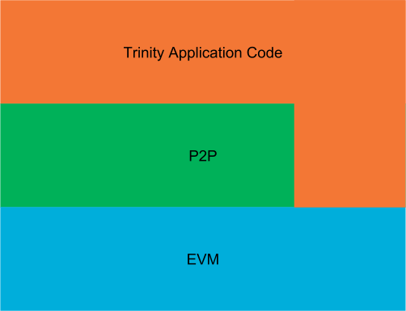
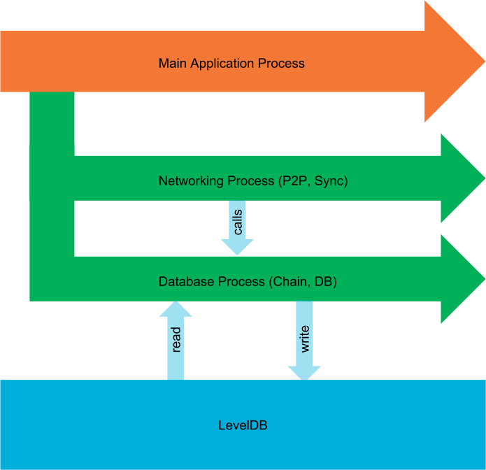

Architecture
============

This guide is intended to provide an overview of the general application architecture that Trinity
follows.

Layering
~~~~~~~~

Trinity is layered to be highly flexible and is based on other independent projects that provide
the foundation for lower levels.

The three main layers from top to bottom are:

- **Trinity Application Code**
- **Peer to Peer (P2P)**
- **Ethereum Virtual Machine (Py-EVM)**

They can be visualized as seen in the following graphic:

The graphic should be understood in such a way that only the higher levels know and use the lower
levels. Consequently, the Trinity application code knows and uses both the P2P and EVM layers.
However, the P2P layer uses only the EVM layer and the EVM layer neither knows nor uses any higher
layers.

Let's go briefly over each layer to understand its main purpose. We won't go into very much detail
for each layer in this guide but rather link to more specific guides that explain the nitty gritty
details.

Let's start bottom up.

EVM
---

EVM stands for Ethereum Virtual Machine and is the lowest level layer that Trinity utilizes to
build and validate blocks, run transactions and execute their code (EVM byte code) to eventually
apply transitions to the state of the Ethereum blockchain.

Notice that the EVM is a seperate project and has no dependency against Trinity and that other
projects are free to use it as the `Py-EVM` project independently from Trinity.

P2P
---

The peer to peer layer implements the
`communication protocol <https://github.com/ethereum/devp2p/blob/master/discv4.md>`_ that each
Ethereum node follows to talk with each other. Ethereum uses an
`Kademlia <https://en.wikipedia.org/wiki/Kademlia>`_-like distributed hash table to store
information about Ethereum nodes.

Trinity Application Code
------------------------

Everything that makes an Ethereum node an Ethereum node and is not part of the EVM or P2P layer is
handled by the Trinity application layer itself. That includes a lot of networking, orchestrating
the existing building blocks for different modes of operations (e.g. light vs full mode), handling
of the different CLI arguments, providing interactive access to the node and the network as well as
lot of other things.

Processes
~~~~~~~~~

An Ethereum node is quite a busy kind of application. There's a constant flow of actions such as
responding to peers, running transactions and validating blocks that will keep the machine busy.

Since Python doesn't play very well with multi threading (mainly because of
`Pythons GIL <https://en.wikipedia.org/wiki/Global_interpreter_lock#Benefits_and_drawbacks>`_),
often the best way to achieve an architecture that can handle concurrency efficiently is through
the usage of multiple processes as well as asynchronous IO. Notice that the usage of
asynchronous IO alone doesn't cut it since a lot concurrent jobs are effectively CPU bound rather
than IO bound.

On startup, Trinity spawns three main processes that we'll briefly explain here.

Main Application Process
------------------------

This is the main process of Trinity that spawns up implicitly when we run the ``trinity`` command.
It is responsible for parsing the command line arguments, orchestrating the building blocks to run
the kind of node the user wants to run and eventually kicks off the networking and the database
process.

Database Process
----------------

The database process exposes several chain-related operations, all of which are bundled in this
single process. These aren't necessarily low-level get/set operations, but also include
higher-level APIs, such as the :func:`~eth.chains.base.Chain.import_block` API.

The way this works is by utilizing Python's :class:`~multiprocessing.managers.BaseManager` API
and exposing several :class:`~multiprocessing.managers.BaseProxy` proxies to coordinate
inter-process access to these APIs.

Since Trinity uses *LevelDB* as its default database, it is a given requirement (of *LevelDB*)
that all database reads and writes are done by a single process.

Networking Process
------------------

The networking process is what kicks off the peer to peer communication and starts the syncing
process. It does so by running an instance of
:func:`~trinity.nodes.base.Node` in an event loop.

Notice that the instance of :func:`~trinity.nodes.base.Node` has access to the APIs that the
database processes exposes. In practice that means that the network process controls the
connections to other peers and starts the syncing process but will call APIs that run inside
the database processes when it comes to actual importing of blocks or reading and writing of other
things from the database.

The networking process also hosts an instance of the
:class:`~trinity.extensibility.plugin_manager.PluginManager` to run plugins that need to deeply
integrate with the networking process (Further reading:
:doc:`Writing Plugins</guides/writing_plugins>`).

Plugin Processes
----------------

Apart from running these three core processes, there may be additional processes for plugins that
run in isolated processes. Isolated plugins are explained in depth in the
:doc:`Writing Plugins</guides/writing_plugins>` guide.