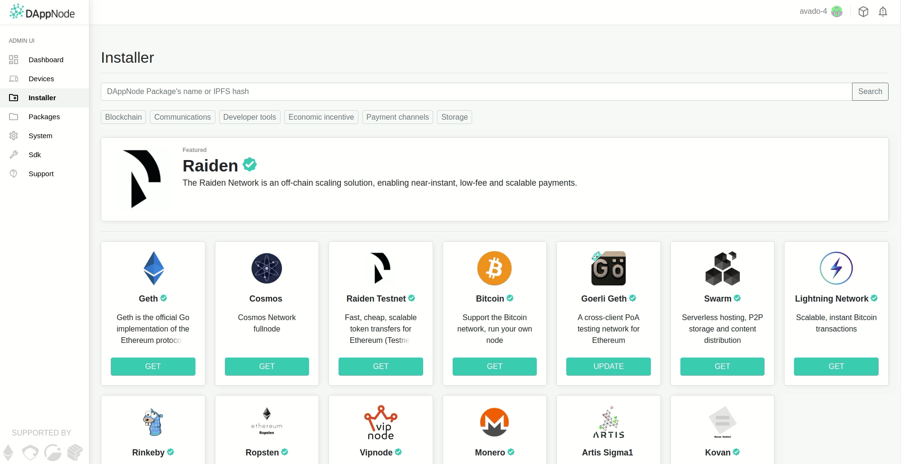
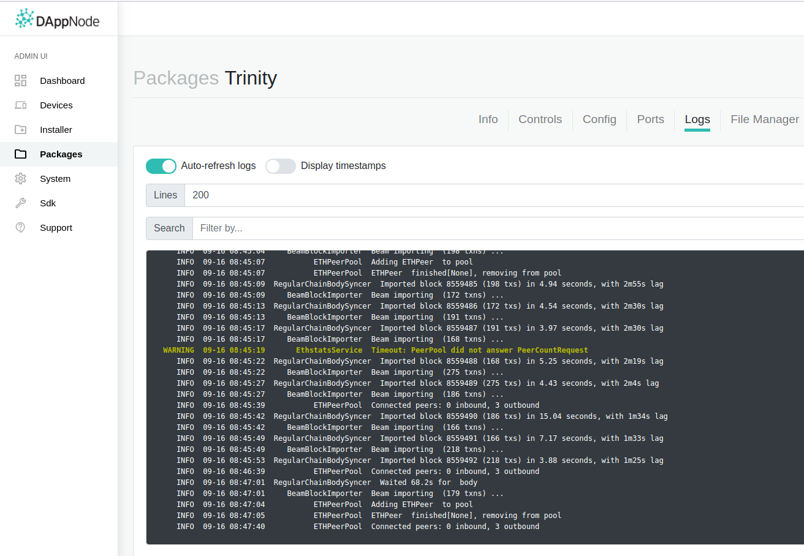
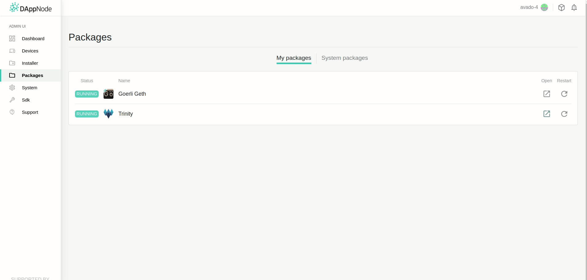

Running Trinity on DappNode
===========================

Trinity can be installed as a DappNode package which is a very convenient way to permanently
keep a node running at home. It's also a nice option for developers to test new code in an
environment that is meant for running these nodes in production.

Installation
~~~~~~~~~~~~

We install Trinity like any other DappNode package by looking up its package name on the
*Installer* page. It is found by the name `trinity.public.dappnode.eth` as shown in the
animation below.

.. note::
  Upgrading from a previous version may not work as expected. If the version that Trinity reports
  on startup doesn't match our expectations, uninstall any currently installed version and reinstall
  the new version rather than upgrading from an existing version.

After Trinity is installed, it will immediately try to find peers and start syncing.

Configuration
~~~~~~~~~~~~~

Configuring Trinity on DappNode is very easy. We can set all CLI flags through the *Config*
page of the package as shown below.

Trinity will automatically reboot using the new parameters whenever we save any changes
on the *Config* page.

.. note::
  Changing or removing the ``--trinity-root-dir`` configuration from its default value
  ``trinity`` will cause us to lose the ability to easily inspect all Trinity related
  files from the host machine.

Tips & tricks for development
~~~~~~~~~~~~~~~~~~~~~~~~~~~~~

We've created this package not only to make it easy to *run* Trinity but also to make it
convenient to *develop* Trinity. We therefore expose two important volumes to the host:

- ``/trinity``: The default ``TRINITY_ROOT_DIRECTORY`` capturing all files that Trinity
  produces at runtime (including logs)

- ``/usr/src/app``: The source directory. Since Trinity is written in Python, exposing the
  source gives us a convenient way to quickly test code changes without recreating and
  reinstalling the package.

The volumes can be found under ``/var/lib/docker/volumes/`` as
``trinitypublicdappnodeeth_trinity`` and ``trinitypublicdappnodeeth_trinity_src``

Using the DappNode as a git remote
----------------------------------

As the package exposes Trinity's source code repository to the host machine, we may want to add it
as a remote to our development environment:

.. code:: sh

  git remote add dappnode root@<ip-of-dappnode>:/var/lib/docker/volumes/trinitypublicdappnodeeth_trinity_src/_data/trinity

With this in place, pushing code to the dappnode is as easy as running ``git push dappnode <branch>``

Downloading logs from the DappNode
----------------------------------

We may also fetch any files including logs from our Dappnode with the command shown below.

.. code:: sh

  scp root@<ip-of-dappnode>:/var/lib/docker/volumes/trinitypublicdappnodeeth_trinity/_data/mainnet/logs-eth1/trinity.log /tmp/trinity_dappnode.log

